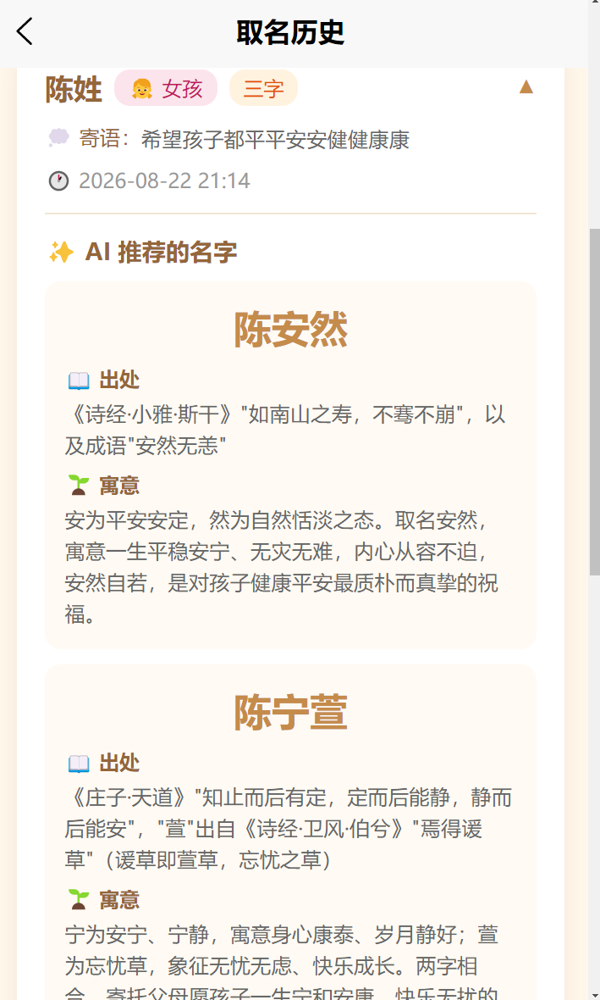

# ✨ AI智能取名助手

一个基于大语言模型的智能取名应用，结合传统诗词文化，
帮助用户生成具有文化内涵和美好寓意的名字。


## 📌 项目介绍

本项目面向家长用户，通过输入宝宝姓氏、性别、名字长度、
个性化要求等信息，利用 AI 大模型生成多个候选名字。

用户可以注册账号、登录系统，并获取个性化取名服务。
所有取名记录会自动保存，方便用户随时回顾和对比。


## 🛠 技术栈


### 后端 Backend

- Python
- FastAPI
- SQLAlchemy（异步 ORM）
- Alembic（数据库迁移）
- MySQL
- JWT 身份认证
- Pydantic
- LangChain + DeepSeek API


### 前端 Frontend

- Vue3
- UniApp（跨端，支持 H5 / 小程序 / App）


### AI

- DeepSeek API
- LangChain
- Agent（结构化输出）


## ✨ 当前功能


### 用户系统

- [x] 用户注册（邮箱验证码）
- [x] 用户登录
- [x] JWT Token 认证（access token + refresh token）
- [x] 邮箱验证码发送


### AI 取名

- [x] 根据姓氏生成名字
- [x] 根据性别生成名字
- [x] 根据名字长度生成名字
- [x] 根据父母寄语生成名字
- [x] AI 返回名字、出处、寓意
- [x] 结构化输出（Pydantic Schema 约束）


### 历史记录

- [x] 取名后自动保存历史记录
- [x] 查看个人历史取名记录列表
- [x] 点击展开查看当时生成的名字详情
- [x] 按时间倒序排列


### 后续计划

- [ ] 增加名字收藏功能
- [ ] 接入诗词知识库（RAG）
- [ ] Agent 调用知识库检索
- [ ] 项目部署上线


## 📷 项目截图

| 登录页 | 注册页 |
|--------|--------|
|  |  |

| 取名页 | 取名结果 |
|--------|----------|
|  |  |

| 历史记录列表 | 历史记录详情 |
|-------------|-------------|
|  |  |


## 📂 项目结构

```
ai-name-assistant
├── backend
│   └── xh-ainame
│       ├── alembic/          # 数据库迁移
│       ├── core/             # 核心模块（认证、邮件、AI Agent）
│       ├── models/           # 数据库模型
│       ├── repository/       # 数据访问层
│       ├── routers/          # 路由层
│       ├── schemas/          # Pydantic 数据模型
│       ├── service/          # 业务逻辑层
│       ├── settings/         # 配置
│       ├── main.py           # 应用入口
│       └── requirements.txt  # 依赖
├── frontend
│   └── ai取名                # UniApp 前端
├── docs
│   └── screenshots/          # 项目截图
└── README.md
```


## 🚀 项目运行


### 后端启动

1. 进入目录：
```bash
cd backend/xh-ainame
```

2. 创建虚拟环境并安装依赖：
```bash
python -m venv .venv
.venv\Scripts\activate
pip install -r requirements.txt
```

3. 配置环境变量：
复制 `.env.example` 为 `.env`，填写数据库连接、邮箱配置、AI API Key。

4. 执行数据库迁移：
```bash
alembic upgrade head
```

5. 启动服务：
```bash
uvicorn main:app --reload
```

API 文档：http://127.0.0.1:8000/docs


### 前端启动

1. 使用 HBuilderX 打开 `frontend/ai取名`
2. 配置后端 API 地址（默认 `http://127.0.0.1:8000`）
3. 运行到浏览器或模拟器


## 📝 开发记录

### 2026-08-22 新增历史取名记录功能

- 新增 `NameHistory` 模型，关联用户表
- Alembic 迁移创建 `name_history` 表
- 新增 `NameHistoryRepository` 数据访问层
- 新增 `NameService` 业务逻辑层（取名 + 保存历史 + 查询历史）
- 新增 `GET /name/history` 接口
- 取名接口 `POST /name/` 增加自动保存历史逻辑
- 前端新增历史记录页面，支持列表展示和展开详情
- 前端取名页增加历史记录入口和保存成功提示


## 👨‍💻 作者

wangxihong-dev
