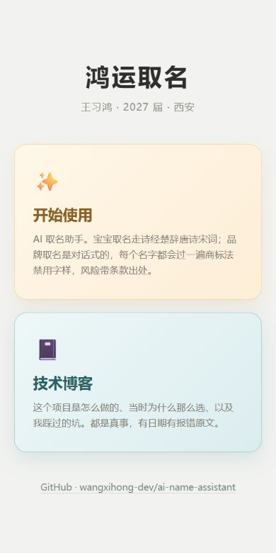
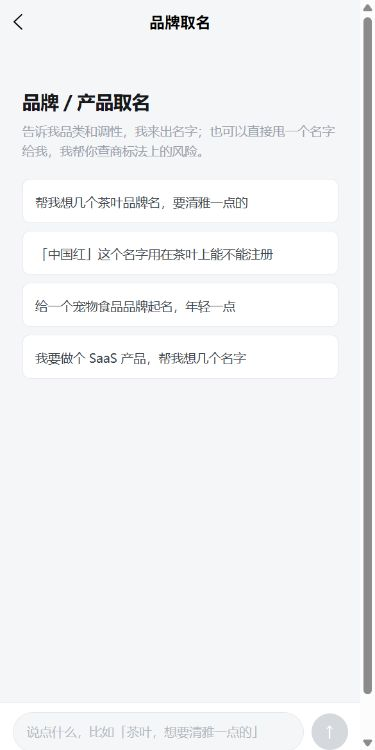
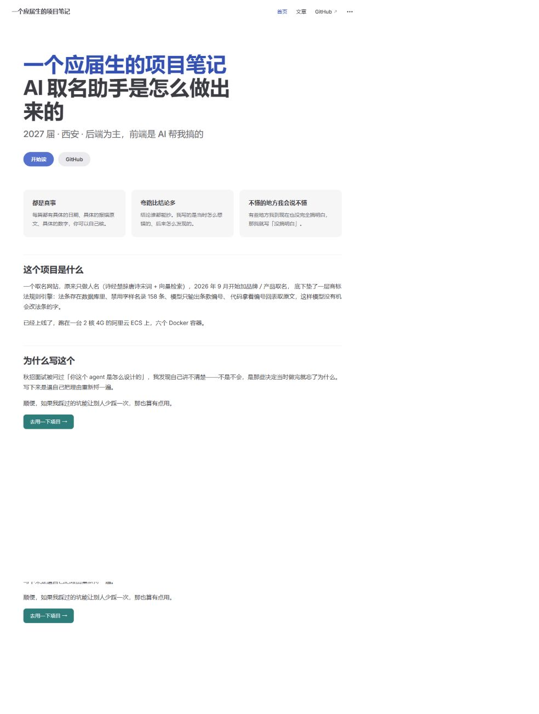

# ✨ AI智能取名助手

一个基于大语言模型的智能取名应用，两条产品线：

- **宝宝取名**（表单版）：结合传统诗词文化，RAG 检索诗词知识库，生成带真实出处的名字
- **品牌 / 产品取名**（对话版）：多轮对话澄清需求，每个候选名过一遍《商标法》禁用字样扫描，风险带条款号和出处

线上同时提供一个门户页和一个技术博客，博客记录这个项目的设计决定和踩过的坑。


## 📌 项目介绍

本项目面向家长用户，通过输入宝宝姓氏、性别、名字长度、
个性化要求等信息，利用 RAG 检索诗词知识库，结合 AI 大模型
生成多个候选名字，并给出诗词出处与寓意解释。

用户可以注册账号、登录系统，获取个性化取名服务，
收藏心仪的名字，所有取名记录自动保存，方便随时回顾对比。


## 🌐 线上访问

| 路径 | 内容 |
|------|------|
| `/` | 门户（两个功能的入口） |
| `/app/` | 取名应用（宝宝取名 + 品牌取名） |
| `/blog/` | 技术博客（VitePress 静态站） |

部署在阿里云 ECS（2 核 4G）上，Docker Compose 编排 6 个容器，Nginx 统一 80 端口入口。


## 🛠 技术栈


### 后端 Backend

- Python
- FastAPI
- SQLAlchemy（异步 ORM）
- Alembic（数据库迁移）
- MySQL
- JWT 身份认证
- Pydantic
- LangChain + DeepSeek API
- SSE 流式响应（Starlette StreamingResponse）


### 前端 Frontend

- Vue3
- UniApp（跨端，支持 H5 / 小程序 / App）
- VitePress（技术博客）


### AI

- DeepSeek API
- LangChain
- Agent（结构化输出）
- Sentence Transformers（BAAI/bge-base-zh-v1.5 中文向量模型，768 维）
- Milvus 向量数据库（Docker 部署，etcd + MinIO）
- RAG 检索增强生成
- 手写 Agent 循环（工具调用 + 结构化输出 + 降级兜底）
- 诗词知识库（唐诗 + 宋词 + 诗经，繁体转简体）


## ✨ 当前功能


### 用户系统

- [x] 用户注册（邮箱验证码）
- [x] 用户登录
- [x] JWT Token 认证（access token + refresh token）
- [x] 邮箱验证码发送


### AI 取名

- [x] 根据姓氏生成名字
- [x] 根据性别生成名字
- [x] 根据名字长度生成名字
- [x] 根据父母寄语生成名字
- [x] 检索诗词知识库，基于真实诗句生成名字出处
- [x] AI 返回名字、出处、寓意
- [x] 结构化输出（Pydantic Schema 约束）


### 历史记录

- [x] 取名后自动保存历史记录
- [x] 查看个人取名历史记录列表
- [x] 点击展开查看当时生成的名字详情
- [x] 按时间倒序排列


### 名字收藏

- [x] 一键收藏喜欢的名字（出处、寓意一并保存）
- [x] 查看我的收藏列表
- [x] 取消收藏


### 诗词 RAG 知识库

- [x] Milvus 向量数据库连接与 Collection 创建（`poetry_vectors`）
- [x] 诗词向量化导入（MySQL → 按行切 chunk → BGE 768 维向量 → Milvus，共 6.7 万+ chunk（67,591 条））
- [x] 向量语义检索（按诗句语义召回相关诗词，并返回标题、作者、出处）
- [x] RAG 接进取名流程（用户需求 → 向量检索 → 构造 Prompt → LLM 生成带出处名字）


### 品牌 / 产品取名（对话版）

- [x] 多轮对话：信息不足时模型主动反问，信息够了直接出名字
- [x] 流式响应（SSE）：等待时实时推送进度（装配法条 → 思考 → 检索诗词 → 核对名录）
- [x] 商标合规扫描：158 条禁用字样名录（国家名称 / 国旗国徽 / 国际组织 / 红十字 / 省级地名等 10 类），包含匹配 + 同类别取最长命中
- [x] 风险带条款出处：条款号 / 原文 / 风险等级 / 法条版本全部由代码回表查出，模型不经手原文
- [x] 同一条款被规则和模型同时命中时聚合成一条，条内保留多个来源
- [x] 会话持久化：一条消息一行存 MySQL，刷新页面可恢复历史
- [x] 模型输出做跨字段校验，不合法的候选名单独丢弃并标记降级，不整次失败


### 后续计划

- [x] 项目部署上线（阿里云 ECS 2C4G，Docker Compose 全链路容器化）
- [x] 品牌 / 产品取名（对话式多轮交互）
- [x] 商标合规校验（《商标法》第十条、第十一条规则引擎）
- [ ] 商标近似查重（第三十条，需要在先商标数据）
- [ ] 评测集（20 条用例，验证检索与合规的准确率）
- [ ] 收藏去重 / 已收藏状态标记（可选优化）


## 📷 项目截图

| 门户 | 功能选择 |
|--------|----------|
|  |  |

| 登录页 | 品牌取名（对话版） |
|--------|--------------------|
|  |  |

| 宝宝取名 | 技术博客 |
|----------|----------|
|  |  |


## 📂 项目结构

```
ai-name-assistant
├── backend
│   └── xh-ainame
│       ├── alembic/                      # 数据库迁移
│       ├── core/                         # 核心模块（认证、邮件、AI Agent）
│       │   ├── milvus.py                 # Milvus 连接客户端
│       │   └── chat_agent.py             # 对话版 Agent 循环（工具调用 + 流式进度）
│       ├── data/
│       │   ├── poetry/                   # 原始诗词数据（JSON）
│       │   └── law/                      # 法条数据（JSON，一个「法律-版本」一个文件）
│       ├── models/                       # 数据库模型
│       │   ├── poetry.py                 # 诗词表
│       │   ├── name_history.py           # 取名历史表
│       │   ├── name_favorite.py          # 名字收藏表
│       │   ├── law_version.py            # 法条版本表（法律名称/版本/施行日/失效日）
│       │   ├── law_clause.py             # 法条条款表（条款号/原文/风险等级）
│       │   ├── forbidden_word.py         # 禁用字样表 + 类别→条款映射表
│       │   └── conversation.py           # 会话表 + 消息表
│       ├── repository/                   # 数据访问层
│       │   ├── poetry_reposityory.py     # MySQL 诗词访问
│       │   ├── milvus_repository.py      # Milvus 访问（建表/插入/搜索）
│       │   ├── name_favorite_repository.py # 收藏数据访问
│       │   ├── law_repository.py         # 法条数据访问
│       │   ├── forbidden_word_repo.py    # 禁用字样数据访问
│       │   └── conversation_repo.py      # 会话数据访问
│       ├── routers/                      # 路由层
│       ├── schemas/                      # Pydantic 数据模型
│       ├── script/                       # 工具脚本
│       │   ├── import_poetry.py          # JSON → MySQL 诗词导入
│       │   ├── import_vector.py          # MySQL → chunk → 向量 → Milvus
│       │   ├── import_law.py             # JSON → MySQL 法条导入（可重复运行）
│       │   ├── test_milvus.py            # Milvus 建表/插入/搜索验证
│       │   └── import_forbidden_words.py # JSON → MySQL 名录导入（幂等 + 导入后校验）
│       ├── service/                      # 业务逻辑层
│       │   ├── embedding_service.py      # BGE 文本向量化
│       │   ├── name_service.py           # 取名 + 历史记录
│       │   ├── favorite_service.py       # 名字收藏
│       │   ├── trademark_service.py      # 商标禁用字样扫描
│       │   ├── law_service.py            # 法条装配（提示词法条段）
│       │   ├── conversation_service.py   # 会话存取与消息还原
│       │   └── chat_service.py           # 对话版门面（编排 + 流式）
│       ├── settings/                     # 配置
│       ├── main.py                       # 应用入口（含 CORS 配置）
│       └── requirements.txt              # 依赖
├── docker
│   └── milvus/
│       ├── docker-compose.yml            # Milvus Standalone（etcd + minio）
│       └── volumes/                      # Milvus 数据目录（git 忽略）
├── frontend
│   └── ai取名                            # UniApp 前端
│       ├── common/api.js                 # 统一请求层（地址/鉴权/错误处理）
│       └── pages/
│           ├── index/                    # 登录页
│           ├── register/                 # 注册页
│           ├── name/                     # 取名页
│           ├── history/                  # 历史记录页
│           ├── favorite/                 # 我的收藏页
│           ├── select/                   # 功能选择页
│           └── chat/                     # 品牌取名对话页
├── blog                                  # VitePress 技术博客（构建产物进前端镜像）
├── docs
│   └── screenshots/                      # 项目截图
└── README.md
```


## 🚀 项目运行


### 后端启动

1. 进入目录：
```bash
cd backend/xh-ainame
```

2. 创建虚拟环境并安装依赖：
```bash
python -m venv .venv
.venv\Scripts\activate
pip install -r requirements.txt
```

3. 配置环境变量：
复制 `.env.example` 为 `.env`，填写数据库连接、邮箱配置、AI API Key。

4. 执行数据库迁移：
```bash
alembic upgrade head
```

5. 导入诗词数据（可选，RAG 功能需要）：
```bash
python script/import_poetry.py
```
脚本会自动将 `data/poetry/` 目录下的诗词 JSON 文件导入数据库，支持繁体转简体、重复跳过。

6. 启动 Milvus 向量数据库（RAG 功能需要）：
```bash
cd docker/milvus
docker compose up -d
```
首次启动会拉取镜像（etcd、MinIO、Milvus Standalone），等待健康检查通过后即可连接 `localhost:19530`。

7. 导入诗词向量（将 MySQL 中的诗词切分并向量化写入 Milvus）：
```bash
cd backend/xh-ainame
python -m script.import_vector
```
脚本按行切分诗词为 chunk，用 BGE 模型生成 768 维向量，写入 `poetry_vectors` Collection。
模型已下载到本地缓存时可离线运行（设置环境变量 `HF_HUB_OFFLINE=1`）。

8. 启动服务：
```bash
uvicorn main:app --reload
```

API 文档：http://127.0.0.1:8000/docs


### 前端启动

1. 使用 HBuilderX 打开 `frontend/ai取名`
2. 后端 API 地址统一在 `common/api.js` 的 `BASE_URL` 中配置（默认 `http://127.0.0.1:8000`）
3. 运行到浏览器或模拟器


### 服务器部署

仓库根目录打 tar 包上传到服务器解压（服务器不连 GitHub），然后：

```bash
cd deploy
docker compose up -d --build
docker compose exec backend alembic upgrade head
docker compose exec backend python -m script.import_law
docker compose exec backend python -m script.import_forbidden_words
```

注意导入脚本要用 `python -m script.xxx` 的方式跑：直接 `python script/xxx.py` 会把 `script/` 放进模块搜索路径，导致 `from models...` 找不到。

Nginx 统一 80 端口：`/` 门户、`/app/` 应用、`/blog/` 博客，`/auth/` `/name/` `/chat/` 反代到后端。


### 技术博客

```bash
cd blog
npm install
npm run dev      # 本地预览
npm run build    # 产物在 docs/.vitepress/dist
```

服务器上跑不了 VitePress 构建（镜像里没有 node 环境给博客用），所以本地构建后把产物拷到 `frontend/ai取名/blog-dist/`，随前端镜像一起部署。


## 📝 开发记录

### 2026-08-18 项目初始化——搭建完整项目框架

- 初始化 FastAPI 后端项目脚手架，配置 Alembic 数据库迁移框架
- 搭建项目分层架构：core（核心模块）、repository（数据访问层）、service（业务逻辑层）、routers（路由层）、schemas（数据模型）、models（ORM 模型）
- 实现用户认证系统（注册、登录、JWT Token 签发与验证）
- 集成 DeepSeek API，实现基础 AI 取名功能（LangChain + Agent 结构化输出）
- 实现邮箱验证码发送功能（QQ 邮箱 SMTP）
- 初始化 UniApp 前端项目，完成登录、注册、取名三个核心页面
- 配置 MySQL 数据库连接，完成首次 Alembic 迁移创建用户表
- 首次提交，项目整体框架搭建完成，前后端可联调运行

### 2026-08-22 新增历史取名记录功能

- 新增 `NameHistory` 模型，关联用户表
- Alembic 迁移创建 `name_history` 表
- 新增 `NameHistoryRepository` 数据访问层
- 新增 `NameService` 业务逻辑层（取名 + 保存历史 + 查询历史）
- 新增 `GET /name/history` 接口
- 取名接口 `POST /name/` 增加自动保存历史逻辑
- 前端新增历史记录页面，支持列表展示和展开详情
- 前端取名页增加历史记录入口和保存成功提示

### 2026-08-26 新增诗词数据导入功能

- 新增 `Poetry` 模型，存储诗词原文（宋诗 + 宋词）
- Alembic 迁移创建 `poetry` 表
- 新增 `PoetryRepository` 数据访问层
- 新增 `script/import_poetry.py` 数据导入脚本
- 支持繁体转简体、批量导入、重复数据自动跳过
- 包含诗词原始数据 JSON（后经补充扩充；最终源数据共 10,671 首：唐诗 5,000、宋词 5,000、诗经 305、唐诗三百首 366）
- 为后续 RAG 检索增强生成功能做数据准备

### 2026-08-29 新增 Milvus RAG 知识库

- 新增 `core/milvus.py`：Milvus 连接客户端
- 新增 `repository/milvus_repository.py`：Milvus 数据访问层（建表 / 批量插入 / 向量搜索）
- 新增 `service/embedding_service.py`：BGE 中文向量模型封装（768 维，余弦归一化）
- 新增 `script/import_vector.py`：MySQL → chunk → 向量 → Milvus 导入脚本
- 新增 `script/test_milvus.py`：Milvus 建表 / 插入 / 搜索验证脚本
- 新增 `docker/milvus/docker-compose.yml`：Milvus Standalone（etcd + MinIO）Docker 编排
- 完成诗词语义检索验证（示例：搜索「明月」可召回相关诗句并返回出处）

### 2026-08-30 RAG 接进取名流程 + 名字收藏功能 + 前端全面改版

- RAG 接进取名：取名时先向量检索诗词，诗句拼入 Prompt，LLM 生成带真实出处的名字
- 新增 `NameFavorite` 模型与 Alembic 迁移，收藏数据入库
- 新增 `NameFavoriteRepository`、`FavoritesService` 分层实现
- 新增接口：`POST /name/favorite`、`GET /name/favorites`、`DELETE /name/delete/{id}`
- 前端新增「我的收藏」页面，取名结果支持一键收藏 / 取消收藏
- 前端统一设计系统（暖色渐变 + 卡片 + 动效），全面改版登录 / 注册 / 取名 / 历史页面
- 优化等待体验（分阶段加载动画、骨架屏）与页面性能（统一请求层、防重复提交、入场动画）
- 后端增加 CORS 配置，支持 H5 前端跨域调用


### 2026-08-31 项目部署上线（阿里云 ECS）+ 部署问题修复

- 新增 Docker 部署配置：后端 Dockerfile（Python slim 镜像）、前端 Dockerfile（Nginx 静态部署）、全链路 docker-compose.yml 编排（6 个容器：mysql、etcd、minio、milvus、backend、frontend）
- 新增 Nginx 反向代理配置，统一入口代理前端静态文件和后端 API
- 新增 .env 环境变量配置模板，支持数据库、Milvus、邮箱、AI API Key 等配置
- 解决阿里云 OOM 问题：添加 4GB Swap 交换分区，保障向量导入时内存充足
- 解决 Milvus 连接超时问题：MILVUS_TIMEOUT=120 加长超时时间
- 解决向量导入中断问题：单首诗词容错 + 3 次重试机制，出错跳过不中断
- 解决 SSH 频繁断开问题：配置 ServerAliveInterval 30 心跳保活
- 完成诗词数据导入（MySQL 1万+ 首，源数据 10,671 首）+ 向量库导入（Milvus 67,591 条向量记录）
- 应用已部署至阿里云 ECS（2 核 4G，Ubuntu 22.04），公网可访问
- 项目从开发、部署到线上运行，全流程打通

### 2026-09-02 线上排障：内存打满导致网站宕机 + 关键数字修正

- 现象：网站突然无法访问；服务器内存仅剩 94M，8G Swap 完全未使用，系统接近卡死
- 排查：发现 `vm.swappiness=0`（云厂商默认配置，拒绝使用 Swap）；`journalctl` 内核日志实锤 OOM killer 杀掉了 Milvus（当时占用 1.68G）
- 救急：重启 ECS，6 个容器凭 `restart: unless-stopped` 自动拉起，网站恢复
- 根治：`sysctl -w vm.swappiness=60` 并写入 /etc/sysctl.conf（优先级高于厂商默认配置）
- 认知：加 Swap 只是装了备胎，swappiness 才是决定用不用的开关；内存紧张 + swappiness=0 必然 OOM
- 数字修正：实际诗词数据为 1万+ 首（源数据 10,671 首：唐诗 5,000、宋词 5,000、诗经 305、唐诗三百首 366），此前记录的 15,665 首有误；向量库实测 67,591 条，无误

### 2026-09-13 商标法条数据层：法条版本表 + 条款表 + 可重复导入

- 新增两张表：`law_version`（法律名称 / 版本名称 / 施行日期 / 失效日期）与 `law_clause`（条款号 / 条款原文 / 风险等级），一对多
- **为什么版本要单独一张表**：《商标法》已于 2026-06-26 全面修订通过、自 2027-01-01 施行，禁止性标志条款从第十条整体移到第十五条。生效日期是「版本」的属性而不是「条款」的属性；拆表之后，2027-01-01 那天代码按日期装配提示词即可自动切换，不用改一行代码
- 两张表都加了联合唯一约束：`law_name + version_name`、`version_id + clause_number`。**条款号必须和版本一起唯一**——新旧两版都有「第十条」，单独唯一会撞号
- 法条原文外置为 JSON（`data/law/商标法-2019修正版.json`），逐字复制自国家知识产权局官网，共 15 条：第十条第一款引导语 + 8 项 + 第二款，第十一条第一款引导语 + 3 项 + 第二款
- 导入脚本 `script/import_law.py` 可重复运行：已存在的版本跳过，不会插重
- 日期在脚本里显式转成 `date` 对象再交给 ORM，不直接塞字符串；`expiry_date` 为 `null` 表示「现行版本，尚无失效日期」

### 2026-09-14 品牌取名版的输出结构：两套 schema + 跨字段校验

- `schemas/agent.py` 新增 6 个类，分两组：**模型产出的**（`ModelOutput` / `CandidateFromModel` / `RiskFromModel`）与**接口返回的**（`AgentSchema` / `Candidate` / `RiskDetail`）
- **为什么分两组**：模型只输出条款的数据库主键 `clause_id` 和命中理由；条款号、条款原文、风险等级、法条版本全部由代码拿 id 回表查出来再拼上。模型不经手原文，就没有记错或改写的机会——这比在提示词里写「必须引用原文」可靠，因为提示词是恳求，代码是防线
- 新增 `intent`（取名 / 合规检查 / 两者都有）与每个候选名的 `origin`（系统生成 / 用户提供），用来区分「模型想出来的名字」和「用户自己拿来问的名字」
- `meaning`（推荐理由）设为**可空**：用户自己起的名字没有「推荐理由」，设成必填会逼模型编一个
- 加 `model_validator(mode="after")` 做跨字段校验，把原先只写在字段描述里的约定变成可执行规则：status 与载荷对应、intent 与 origin 对应、系统生成的名字必须有推荐理由。20 个对照用例（7 个合法 + 13 个非法）全部符合预期
- 旧表单版（人名取名）的 `NameSchema` / `NameResultSchema` 未改动，两条路互不影响

### 2026-09-15 禁用字样名录 + 商标扫描服务

- 新增两张表：`forbidden_word`（字样 + 类别）与 `word_kind_clause`（类别 → 条款映射，带版本外键）
- **为什么加中间层**：2027-01-01 法条换版时「国家名称」对应的条款 id 会变；有中间层则 158 条字样一个字不动，只加 10 行映射
- 名录 158 条、10 个类别；省级行政区划 34 条逐字抄自官方名单，不让模型背
- 新增 `service/trademark_service.py`：包含匹配 + 同类别取最长命中 + 回表拼装风险；查不到映射或条款直接报错，不静默跳过

### 2026-09-17 对话版 Agent 循环 + 流式响应

- 新增 `core/chat_agent.py`：手写 Agent 循环，把 `ModelOutput` 当作第二个工具绑进去。原因实测过：`with_structured_output` 与 `bind_tools` 不能共存，三种 method 都会把真工具挤掉
- 流式响应走 SSE：等待时推送进度事件（装配法条 / 思考 / 检索诗词 / 核对名录），最后推完整结果
- 提示词把信息分成「必需」和「加分」两类：品类不知道才反问；调性 / 人群缺失时模型自己选方向并在寓意里说明
- `AgentSchema` 校验失败的候选名单独丢弃并标记降级，不整次报废

### 2026-09-18 会话持久化 + 对话版接口

- 新增 `conversation` / `conversation_message` 两张表，一条消息一行；system 消息不落库（提示词是代码不是数据）
- 新增 `POST /chat/` 与 `POST /chat/stream`，均需登录并校验会话归属
- 失败文案按原因分成三种：数据故障 / 模型输出格式不合法 / 未知异常

### 2026-09-19 门户 + 技术博客 + 部署结构调整

- 新增门户页（纯静态）占 80 端口根路径；应用迁到 `/app/`（manifest 的 h5.router.base），博客在 `/blog/`
- 新增 VitePress 技术博客，四篇：法条存数据库 / AI 编的出处 / 一半代码是 AI 写的 / Milvus 被 OOM 杀掉
- 前端登录 / 注册 / 功能选择 / 对话四页去掉 emoji 和渐变背景，统一浅灰底 + 青色
- 踩坑记录：nginx 官方入口脚本 `10-listen-on-ipv6-by-default.sh` 在处理被替换过的 default.conf 时会卡住导致 nginx 起不来；改成自有文件名 `app.conf` 并删除 default.conf 绕过


## 👨‍💻 作者

wangxihong-dev
